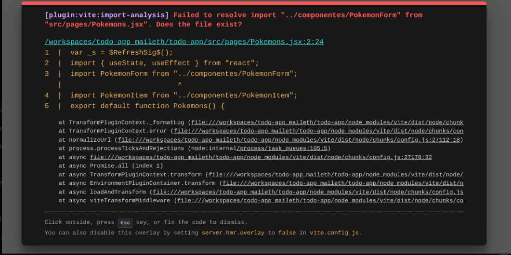
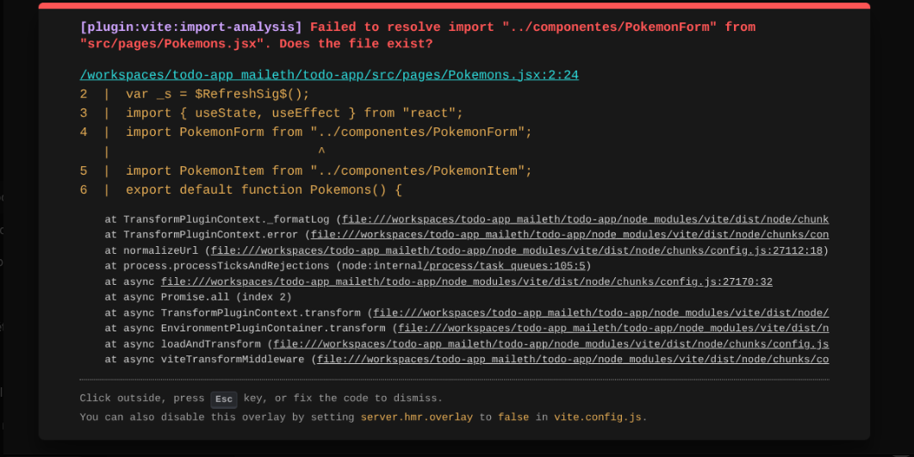

# todo-app_maileth
(: aprendiz: Maileth Begambre Movilla (:

 Todo App — Proyecto Final React + PokeAPI

Aplicación web desarrollada con React, React Router DOM y consumo de API, que permite gestionar una lista de tareas  (Todos) y visualizar Pokemons obtenidos desde la PokéAPI.  
Este proyecto fue desarrollado como parte del trabajo final y cumple con todos los requisitos solicitados en la guía.

## Funciones principales del proyecto

###  Navegación entre páginas
El proyecto incluye rutas creadas con React Router DOM:

- home → Página principal  
- registro - Página de registro  
- pokemons - Vista con datos de PokéAPI  
- poketodos  - es la misma  pagina de pokemons donde esta la vista de 20 datos de la pokeapi y ademas estan las funciones de agregar, eliminar y  cambiar de estado 
a los pokemons

 CRUD básico de To-Do List
Incluye:

- Listado de todos provenientes de API
- Formulario para crear nuevos pokemons
- Validación básica (evita campos vacíos)
- Marcar tareas como completadas / pendientes
- Eliminar tareas
- Estados de carga mientras se obtienen datos
- Manejo básico de errores con try/catch
- Componentes separados y reutilizables

 Consumo de PokéAPI
En la ruta /pokemons

- Se hace fetch a: https://pokeapi.co/api/v2/pokemon?limit=20
- Se muestran 20 Pokemons(probando el boton de eliminar elimine algunos pokemones por eso puede que al ejecutar el proyecto no se muestren los 20)
- Se manejan errores y estados de carga
- Se separa la lógica en componentes:
  - PokemonForm
  - PokemonItem

  Arquitectura del Proyecto

 
 src/
├── pages/
│  │   ├── componentes/ 
│  │   ├── PokemonForm.jsx
│  │   ├── PokemonItem.js
│  │   ├── PokemonForm.jsx
│  │   └── Filtros.jsx
│  ├── Home.jsx
│  ├── Registro.jsx
│  └── Pokemons.jsx
│
├── App.jsx
├── index.css
└── main.jsx

 Tecnologías utilizadas

- React 18  
- React Router DOM  
- Vite  
- Fetch API  
- JavaScript moderno (ES6+)  
- CSS global (app.css)

 Instalación:

1. Clonar el repositorio:

bash
git clone https://github.com/maileth2008/todo-app_maileth.git

2. Instalar dependencias:

npm install

3. Ejecutar servidor local:

npm run dev
4. Abrir en navegador:

http://localhost:5173

Descripción del desarrollo

Este proyecto fue construido siguiendo buenas prácticas:

Uso correcto de estados (useState)

Peticiones a APIs con useEffect

Manejo de errores y carga

Código modular separado por componentes

Navegación limpia sin errores de <Router>

Estructura ordenada de carpetas

Durante el desarrollo resolví errores reales como:

Importaciones incorrectas

Problema de doble <BrowserRouter>

Archivos faltantes o mal ubicados

Páginas en blanco por return incorrectos

Errores de Vite al compilar

Todo esto fortaleció la calidad final del proyecto.

ejemplo de errores que tuve al intentar hacer el proyecto :

PokéTodos
Nuevo Poké-TODO
Agregar
bulbasaur — completadoCambiar estadoEliminar
ivysaur — pendienteCambiar estadoEliminar
venusaur — pendienteCambiar estadoEliminar
charmander — pendienteCambiar estadoEliminar
charmeleon — pendienteCambiar estadoEliminar
charizard — pendienteCambiar estadoEliminar
squirtle — pendienteCambiar estadoEliminar
wartortle — pendienteCambiar estadoEliminar
blastoise — pendienteCambiar estadoEliminar
caterpie — pendienteCambiar estadoEliminar
metapod — pendienteCambiar estadoEliminar
butterfree — pendienteCambiar estadoEliminar
weedle — pendienteCambiar estadoEliminar
kakuna — pendienteCambiar estadoEliminar
beedrill — pendienteCambiar estadoEliminar
pidgey — pendienteCambiar estadoEliminar
pidgeotto — pendienteCambiar estadoEliminar
pidgeot — pendienteCambiar estadoEliminar
rattata — pendienteCambiar estadoEliminar
raticate — pendienteCambiar estadoEliminar
[plugin:vite:react-babel] /workspaces/todo-app_maileth/todo-app/src/pages/Pokemons.jsx: Identifier 'EditarTodo' has already been declared. (134:9)
  137 |       <h2>Editar Todo (Pendiente de implementación)</h2>
/workspaces/todo-app_maileth/todo-app/src/pages/Pokemons.jsx:134:9
132 |  }
133 |  
134 |  function EditarTodo() {
    |           ^
135 |    return (
136 |      

    at constructor (/workspaces/todo-app_maileth/todo-app/node_modules/@babel/parser/lib/index.js:367:19)
    at JSXParserMixin.raise (/workspaces/todo-app_maileth/todo-app/node_modules/@babel/parser/lib/index.js:6624:19)
    at ScopeHandler.checkRedeclarationInScope (/workspaces/todo-app_maileth/todo-app/node_modules/@babel/parser/lib/index.js:1646:19)
    at ScopeHandler.declareName (/workspaces/todo-app_maileth/todo-app/node_modules/@babel/parser/lib/index.js:1612:12)
    at JSXParserMixin.registerFunctionStatementId (/workspaces/todo-app_maileth/todo-app/node_modules/@babel/parser/lib/index.js:13542:16)
    at JSXParserMixin.parseFunction (/workspaces/todo-app_maileth/todo-app/node_modules/@babel/parser/lib/index.js:13526:12)
    at JSXParserMixin.parseFunctionStatement (/workspaces/todo-app_maileth/todo-app/node_modules/@babel/parser/lib/index.js:13201:17)
    at JSXParserMixin.parseStatementContent (/workspaces/todo-app_maileth/todo-app/node_modules/@babel/parser/lib/index.js:12867:21)
    at JSXParserMixin.parseStatementLike (/workspaces/todo-app_maileth/todo-app/node_modules/@babel/parser/lib/index.js:12843:17)
    at JSXParserMixin.parseModuleItem (/workspaces/todo-app_maileth/todo-app/node_modules/@babel/parser/lib/index.js:12820:17)
    at JSXParserMixin.parseBlockOrModuleBlockBody (/workspaces/todo-app_maileth/todo-app/node_modules/@babel/parser/lib/index.js:13392:36)
    at JSXParserMixin.parseBlockBody (/workspaces/todo-app_maileth/todo-app/node_modules/@babel/parser/lib/index.js:13385:10)
    at JSXParserMixin.parseProgram (/workspaces/todo-app_maileth/todo-app/node_modules/@babel/parser/lib/index.js:12698:10)
    at JSXParserMixin.parseTopLevel (/workspaces/todo-app_maileth/todo-app/node_modules/@babel/parser/lib/index.js:12688:25)
    at JSXParserMixin.parse (/workspaces/todo-app_maileth/todo-app/node_modules/@babel/parser/lib/index.js:14568:25)
    at parse (/workspaces/todo-app_maileth/todo-app/node_modules/@babel/parser/lib/index.js:14602:38)
    at parser (/workspaces/todo-app_maileth/todo-app/node_modules/@babel/core/lib/parser/index.js:41:34)
    at parser.next (<anonymous>)
    at normalizeFile (/workspaces/todo-app_maileth/todo-app/node_modules/@babel/core/lib/transformation/normalize-file.js:64:37)
    at normalizeFile.next (<anonymous>)
    at run (/workspaces/todo-app_maileth/todo-app/node_modules/@babel/core/lib/transformation/index.js:22:50)
    at run.next (<anonymous>)
    at transform (/workspaces/todo-app_maileth/todo-app/node_modules/@babel/core/lib/transform.js:22:33)
    at transform.next (<anonymous>)
    at step (/workspaces/todo-app_maileth/todo-app/node_modules/gensync/index.js:261:32)
    at /workspaces/todo-app_maileth/todo-app/node_modules/gensync/index.js:273:13
    at async.call.result.err.err (/workspaces/todo-app_maileth/todo-app/node_modules/gensync/index.js:223:11)
    at /workspaces/todo-app_maileth/todo-app/node_modules/gensync/index.js:189:28
    at /workspaces/todo-app_maileth/todo-app/node_modules/@babel/core/lib/gensync-utils/async.js:67:7
    at /workspaces/todo-app_maileth/todo-app/node_modules/gensync/index.js:113:33
    at step (/workspaces/todo-app_maileth/todo-app/node_modules/gensync/index.js:287:14)
    at /workspaces/todo-app_maileth/todo-app/node_modules/gensync/index.js:273:13
    at async.call.result.err.err (/workspaces/todo-app_maileth/todo-app/node_modules/gensync/index.js:223:11)
Click outside, press Esc key, or fix the code to dismiss.
You can also disable this overlay by setting server.hmr.overlay to false in vite.config.js.

errores que resolvi con ayuda de la inteligencia artificial
Lista de commits realizados

feat: creación de estructura inicial con rutas

feat: componente pokemons.jsx con fetch inicial

feat: listado de pokemons desde API

feat: formulario para crear pokemons con validación

feat: marcar pokemons como completado/pendiente

feat: eliminar pokemons

feat: estados de carga

feat: manejo básico de errores

refactor: separación de lógica en componentes

docs: actualización del README

chore: placeholder para editar pokemons

chore: placeholder para filtros de tareas 

Estado del proyecto

 Completamente funcional
 Cumple con todos los requisitos de la gia 
 Estructura modular
 API funcionando
 Navegación estable
 Código limpio
 README completo

 (: